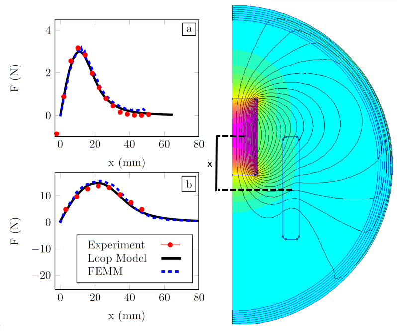

<<<<<<< HEAD

=======
# FEMM-Solenoid-Example
A python script that works with FEMM to solve for the force between a magnet and coil. I validated this with experiments

![./README_pic]
>>>>>>> 2fbcbc9e0de45be593a744ccfcb37e05baae2dd8
